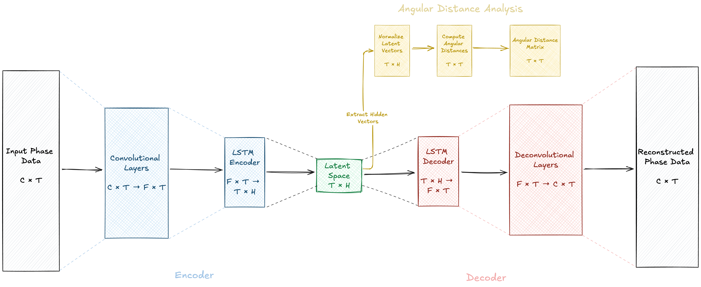
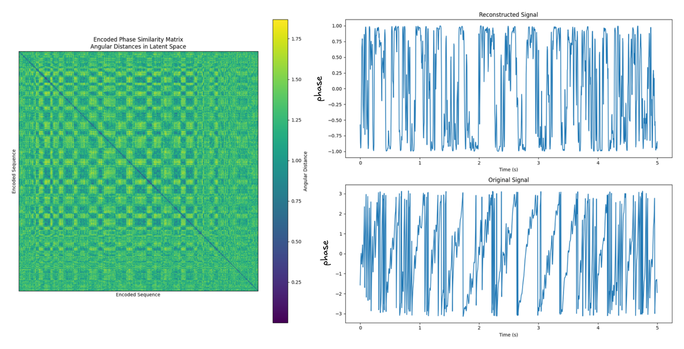

# EEG Signal Autoencoder

This project implements an autoencoder for compressing multivariate EEG signals. The preprocessing step extracts phase values from the EEG data, which are then used to train the autoencoder. The model learns by comparing the compressed information with the original input.

## Data Structure

The data should be organized in the following structure:

```
data/
├── AD/
│ ├── subject1/
│ │ ├── file1_good_eeg.fif
│ │ └── file2_good_eeg.fif
│ └── subject2/
│ └── subject3/
├── HID/
│ ├── subject1/
│ │ ├── file1_good_eeg.fif
│ │ └── file2_good_eeg.fif
│ └── subject2/
│ └── subject3/
└── MCI/
│ ├── subject1/
│ │ ├── file1_good_eeg.fif
│ │ └── file2_good_eeg.fif
│ └── subject2/
│ └── subject3/
```

## Model Architecture

<!-- html link image -->


The model architecture consists of convolutional layers followed by LSTM layers to compress the multivariate EEG signal.

## Recurrence Matrix Generation

The `generateRM` pipeline in the Makefile generates recurrence matrices from the compressed representations in the LSTM layer. These matrices represent the compressed data for each chunk of the multivariate EEG signal.

The recurrence matrices use angular distance instead of Euclidean distance due to the use of phase values. This allows for better representation of the circular nature of phase data.



## Installation

1. Clone the repository:
   ```
   git clone https://github.com/your-username/EEG-Signal-Autoencoder.git
   cd EEG-Signal-Autoencoder
   ```

2. Set up your Python environment (Python 3.7+ recommended).

3. Install the required packages:
   ```
   pip install -r requirements.txt
   ```

4. Open the Makefile and set the `PROJECT_DIR` variable to your project directory path.

5. Set the `PYTHON_ENV` variable in the Makefile to your Python interpreter path.

## Usage

Before running any commands, make sure you're in the project directory.

Use the following make commands to run different parts of the pipeline:

- `make train_model`: Start the model training process.
- `make generate_rm`: Generate recurrence matrices from trained model.
- `make visualize_latent_space`: Visualize the latent space representation.
- `make plot_html_cloud`: Generate an interactive HTML plot of the latent space representation.
- `make visualize_model_architecture`: Visualize the model architecture.
- `make signal_analysis`: Run signal analysis on the data.


## Latent Space Visualization

The latent space visualization creates a 3D point cloud using UMAP, with labels representing different conditions (AD, HID, MCI). This allows you to observe how the model learns to represent the data samples over time.


## Weights & Biases Integration

To track the training progress and visualize results:

1. Create a `.env` file in the project root.
2. Add your Weights & Biases API token to the `.env` file:
   ```
   WANDB_API_KEY=your_api_token_here
   ```

You can then view the progress of reconstruction and sample matrices in the Weights & Biases dashboard, along with other training metrics.

**License**

[Creative Commons Attribution-NonCommercial 4.0 International License](https://creativecommons.org/licenses/by-nc/4.0/).

