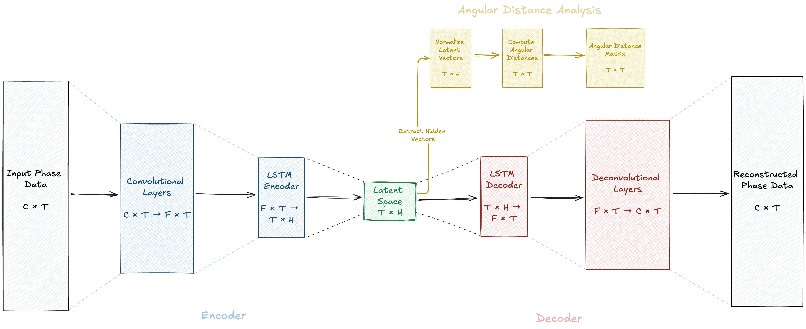
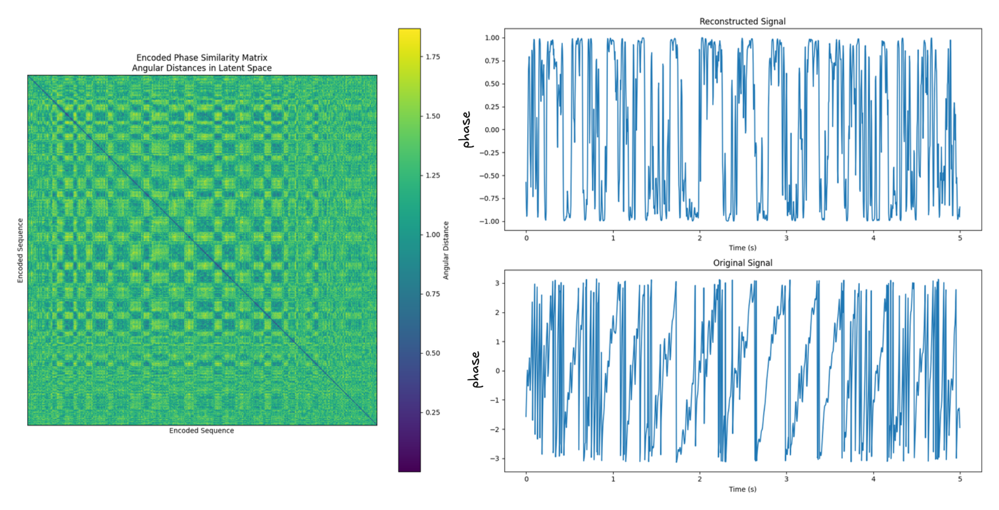
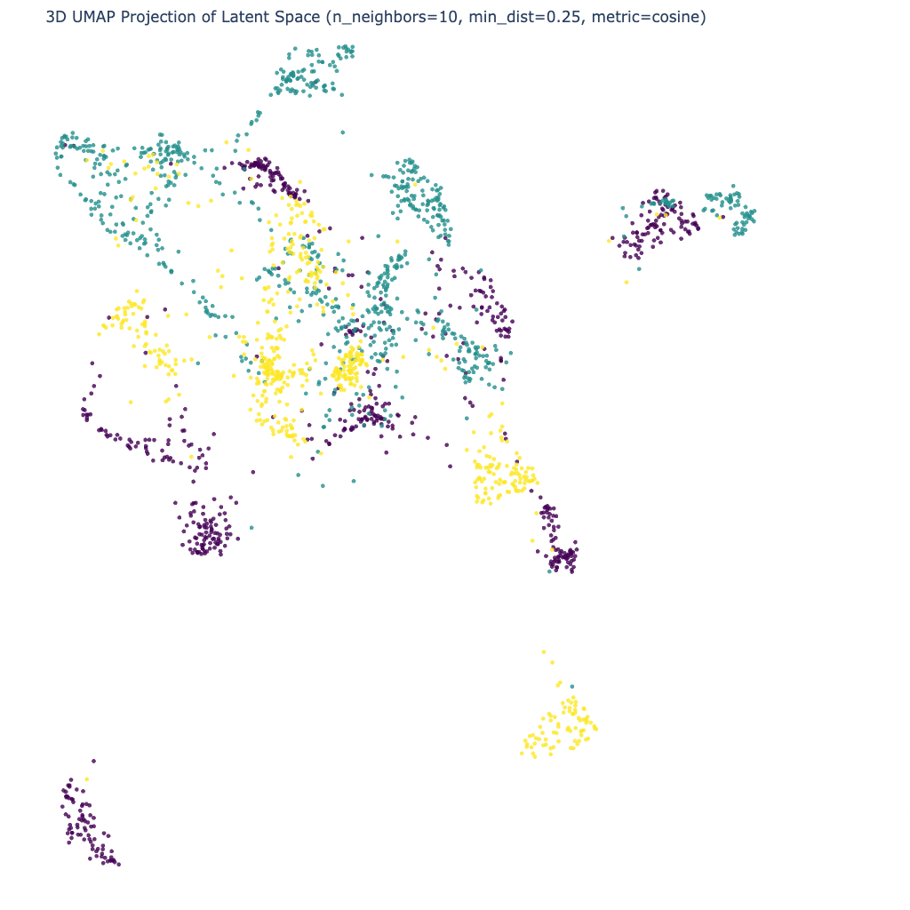

# **Title:** Highlighting Temporal Patterns in Resting-State EEG Using Autoencoder Latent Spaces and Multivariate Angular Distance Analysis

---

## **Abstract**

Analyzing resting-state electroencephalogram (EEG) data presents significant challenges due to the absence of explicit events and high susceptibility to noise, making it difficult to identify informative signal segments. This study proposes a method that leverages an autoencoder architecture to learn latent representations from multichannel EEG phase data. By constructing angular distance matrices from the latent space and applying dimensionality reduction techniques such as UMAP, temporal patterns indicative of different cognitive states are highlighted. This approach addresses the complexities inherent in traditional recurrence quantification analysis (RQA) by providing a data-driven embedding without extensive hyperparameter tuning. It facilitates informed decisions on segment selection for analysis and offers insights into the underlying neural dynamics in resting-state EEG interpretation.

---

## **1. Introduction**

Resting-state EEG is a valuable tool for investigating the intrinsic functional architecture of the brain. However, analyzing resting-state EEG signals is complicated by the lack of task-related events and high susceptibility to noise and artifacts. Traditional methods often struggle to determine which segments of the signal are most informative, potentially leading to biases or omission of critical information.

Recurrence quantification analysis (RQA) provides a framework for analyzing the dynamical properties of time-series data by constructing recurrence matrices that reveal patterns of recurrence in the system's phase space. A significant challenge in RQA is determining appropriate embeddings for constructing these matrices. Time-delay embeddings, for instance, introduce hyperparameters such as time delay  \tau  and embedding dimension  m , which require careful selection. The optimal values for these parameters are often unknown, especially for complex, high-dimensional systems like multichannel EEG, where the attractor's structure in phase space is not well-defined.

Alternative embedding methods, such as those based on short-time Fourier transform (STFT) spectrograms, also introduce parameters that influence temporal resolution and frequency content, potentially affecting the analysis. The choice of embedding thus becomes a critical factor that can introduce biases and affect the interpretability of the results.

Autoencoders offer a potential solution by learning data-driven embeddings that capture essential features of EEG signals. Despite concerns about the "black box" nature of such models, autoencoders can serve as tools to guide analysis, allowing for the selection of informative signal segments that can be further examined using standard EEG analysis methods.

The hypothesis explored in this study is that the latent space learned by an autoencoder can capture essential features of EEG data, and constructing angular distance matrices from this latent space can highlight temporal patterns indicative of different cognitive states. This approach aims to reduce reliance on hyperparameter-dependent embeddings in traditional RQA and to provide a method for informed segment selection in resting-state EEG analysis.

---

## **2. Methods**

### **2.1 Participants**

*Placeholder for participant demographics, inclusion criteria, and ethical considerations.* - left blank intentionally

### **2.2 Data Acquisition and Preprocessing**

EEG data were recorded from  N  subjects, each comprising  C  channels and  T  time points. The raw EEG signals  \mathbf{X} = \{\mathbf{x}^{(i)}\}_{i=1}^N , where  \mathbf{x}^{(i)} \in \mathbb{R}^{C \times T} , underwent the following preprocessing steps:

1. **Bandpass Filtering**: A bandpass filter was applied to remove low-frequency drifts and high-frequency noise:

   \[
   \mathbf{x}^{(i)}_{\text{filtered}} = \text{Bandpass}(\mathbf{x}^{(i)}).
   \]

2. **Laplacian Referencing**: To enhance spatial resolution and minimize volume conduction effects, a surface Laplacian transformation was applied:

   \[
   \tilde{\mathbf{x}}^{(i)} = \text{Laplacian}\left( \mathbf{x}^{(i)}_{\text{filtered}} \right).
   \]

3. **Phase Extraction**: The instantaneous phase information was extracted using the Hilbert transform, capturing the timing of neural oscillations:

   \[
   \phi^{(i)} = \arg\left( \text{Hilbert}\left( \tilde{\mathbf{x}}^{(i)} \right) \right), \quad \phi^{(i)} \in [-\pi, \pi]^{C \times T}.
   \]

4. **Segmentation**: The continuous phase data were segmented into fixed-duration chunks of 5 seconds to capture temporal dynamics while managing computational load.

### **2.3 Autoencoder Architecture**

An autoencoder with an encoder-decoder structure was designed to learn compressed, data-driven embeddings of the multichannel EEG phase data.

Figure 1. Model Architecture

#### **Encoder**

The encoder compresses the high-dimensional input  \phi^{(i)}  into a lower-dimensional latent space:

1. **Convolutional Layers**: Spatial features across all electrodes were captured:

   \[
   \mathbf{h}_{\text{conv}}^{(i)} = f_{\text{conv}}\left( \phi^{(i)} \right), \quad \mathbf{h}_{\text{conv}}^{(i)} \in \mathbb{R}^{F \times T},
   \]

   where  F  denotes the number of feature maps.

2. **Long Short-Term Memory (LSTM) Layer**: Temporal dependencies in the data were modeled:

   \[
   \mathbf{h}_{\text{lstm}}^{(i)} = f_{\text{lstm}}\left( \mathbf{h}_{\text{conv}}^{(i)} \right), \quad \mathbf{h}_{\text{lstm}}^{(i)} \in \mathbb{R}^{T' \times H},
   \]

   where  H  is the hidden size of the LSTM layer, and  T'  represents the length of the encoded sequence, which may differ from  T  due to downsampling or other transformations within the network.

The latent space  \mathbf{h}_{\text{lstm}}^{(i)}  serves as a data-driven embedding that does not require explicit hyperparameter selection for time delays or embedding dimensions, unlike traditional methods.

#### **Decoder**

The decoder reconstructs the input data from the latent representation:

1. **LSTM Layer**:

   \[
   \hat{\mathbf{h}}_{\text{lstm}}^{(i)} = f_{\text{lstm\_dec}}\left( \mathbf{h}_{\text{lstm}}^{(i)} \right).
   \]

2. **Deconvolutional Layers**:

   \[
   \hat{\phi}^{(i)} = f_{\text{deconv}}\left( \hat{\mathbf{h}}_{\text{lstm}}^{(i)} \right), \quad \hat{\phi}^{(i)} \in [-\pi, \pi]^{C \times T}.
   \]

#### **Training Objective**

The autoencoder was trained to minimize the reconstruction loss between the input and the reconstructed output:

\[
\mathcal{L}_{\text{recon}} = \frac{1}{N} \sum_{i=1}^N \left\| \phi^{(i)} - \hat{\phi}^{(i)} \right\|_2^2.
\]

### **2.4 Angular Distance Matrix Construction**

To capture the temporal dynamics embedded in the learned latent space, angular distance matrices were constructed based on the angular distance between latent vectors.

Figure 2. Angular Distance Matrix for all channels in a chunk of data. Top right corner shows the reconstruction of the input signal for a single channel.

1. **Normalization of Latent Vectors**: Each latent vector at encoded time index  t'  was normalized to unit length:

   \[
   \tilde{\mathbf{h}}_{\text{lstm}, t'}^{(i)} = \frac{ \mathbf{h}_{\text{lstm}, t'}^{(i)} }{ \left\| \mathbf{h}_{\text{lstm}, t'}^{(i)} \right\|_2 }.
   \]

2. **Angular Distance Computation**: The angular distance between pairs of latent vectors was calculated without applying a threshold:

   \[
   D_{t'_1, t'_2}^{(i)} = \alpha_{t'_1, t'_2}^{(i)} = \arccos\left( \tilde{\mathbf{h}}_{\text{lstm}, t'_1}^{(i)} \cdot \tilde{\mathbf{h}}_{\text{lstm}, t'_2}^{(i)} \right).
   \]

**Dimension Considerations**:

- The angular distance matrix  D^{(i)} \in [0, \pi]^{T' \times T'}  represents the pairwise angular distances between latent vectors at different positions in the encoded sequence.
- While the indices  t'  correspond to positions in the encoded sequence, they often maintain a strong relationship with the original time indices  t , albeit potentially compressed or expanded.
- The encoder's architecture (e.g., convolutional and LSTM layers) tends to preserve the temporal order and relative timing of events, but may introduce some non-linear transformations:
  - Local temporal relationships are generally preserved, allowing for the identification of specific events or patterns in both the original and encoded sequences.
  - Larger-scale temporal structures may be compressed or expanded, potentially highlighting multi-scale temporal dynamics.
- The angular distance matrix reveals both local and global temporal patterns:
  - Diagonal structures often correspond directly to temporal events in the original signal.
  - Off-diagonal patterns may reveal longer-range temporal dependencies or recurring patterns at different time scales.
- While not a direct measure of time intervals, the matrix can exhibit scale-free properties and power law relationships, reflecting the multi-scale nature of EEG dynamics.
- The preservation of temporal structure allows for meaningful interpretation of the matrix in relation to the original time series, but care should be taken when making precise temporal inferences.

**Visualization Considerations**:

- When plotting  D^{(i)} , axes should be labeled as "Encoded Sequence Index" to reflect that the indices represent positions in the latent space rather than specific time points.
- Time labels should be avoided on the axes of the angular distance matrix to prevent implying a direct, linear relationship with the original time scale.

The angular distance matrix reflects relationships in the encoded space, providing insights into the temporal similarity of multivariate neural activity as represented by the autoencoder's latent space. By retaining the full distance information without thresholding, a more nuanced analysis of temporal dynamics is possible.

### **2.5 Latent Space Visualization**

To explore the structure of the latent space and identify potential group differences, UMAP was applied for dimensionality reduction:

Figure 3. Latent Space Visualization

1. **Latent Vector Aggregation**: For each sample, latent vectors were aggregated across the encoded sequence by computing the mean:

   \[
   \mathbf{h}_{\text{mean}}^{(i)} = \frac{1}{T'} \sum_{t'=1}^{T'} \mathbf{h}_{\text{lstm}, t'}^{(i)}.
   \]

2. **UMAP Projection**: The aggregated latent vectors were projected into a three-dimensional space:

   \[
   \mathbf{z}^{(i)} = \text{UMAP}\left( \mathbf{h}_{\text{mean}}^{(i)} \right), \quad \mathbf{z}^{(i)} \in \mathbb{R}^3.
   \]

This visualization allows for the inspection of clusters potentially corresponding to different cognitive states, providing insights into underlying neural dynamics without relying on the autoencoder for final classification decisions.

---

## **3. Results**

*Placeholder for presentation of findings, including UMAP visualizations of the latent space, differences in angular distance matrices among groups, and interpretation of temporal patterns.* - left blank intentionally

---

## **4. Discussion**

Analyzing resting-state EEG data is fraught with challenges, particularly in constructing appropriate embeddings for recurrence quantification analysis. Traditional methods, such as time-delay embeddings, require the selection of hyperparameters like time delay  \tau  and embedding dimension  m , which can significantly influence results. The lack of consensus on optimal embedding parameters for multichannel EEG data introduces variability and potential biases into analysis.

The approach presented addresses these challenges by utilizing an autoencoder to learn a data-driven embedding from EEG phase data. This method reduces dependence on hyperparameter selection inherent in traditional embeddings, as the autoencoder inherently captures essential features of the data through training.

By constructing angular distance matrices from the latent space without applying a threshold, temporal patterns are highlighted. These matrices provide detailed information about temporal similarity between latent representations at different positions in the encoded sequence. Retaining full distance information allows for a more nuanced analysis of temporal dynamics, potentially revealing patterns that thresholded recurrence matrices might obscure.

---

## **5. Conclusion**

This report presents a methodology that integrates autoencoders with multivariate angular distance analysis to highlight temporal patterns in resting-state EEG data. By leveraging the autoencoder's ability to learn data-driven embeddings, the approach addresses challenges associated with traditional embedding methods in RQA, reducing reliance on hyperparameter selection and potential biases. Constructing angular distance matrices from the latent space without thresholding retains full temporal similarity information, revealing patterns indicative of different cognitive states.

**Important Considerations**:

While the autoencoder could be used for classification due to its representation learning, the primary focus is on guiding analysis and enhancing interpretability through standard EEG methods. 

---

## **References**

*Placeholder for references to relevant literature on EEG analysis, autoencoders, recurrence quantification analysis, and dimensionality reduction techniques.* - left blank intentionally

---

## **Appendix**

### **A. Mathematical Notation and Definitions**

- **EEG Data**:  \mathbf{X} = \{\mathbf{x}^{(i)}\}_{i=1}^N , where  \mathbf{x}^{(i)} \in \mathbb{R}^{C \times T} .
- **Preprocessed Data**:  \tilde{\mathbf{x}}^{(i)}  after bandpass filtering and Laplacian referencing.
- **Phase Data**:  \phi^{(i)} = \arg\left( \text{Hilbert}\left( \tilde{\mathbf{x}}^{(i)} \right) \right) .
- **Convolutional Output**:  \mathbf{h}_{\text{conv}}^{(i)} = f_{\text{conv}}\left( \phi^{(i)} \right) .
- **LSTM Hidden States**:  \mathbf{h}_{\text{lstm}}^{(i)} = f_{\text{lstm}}\left( \mathbf{h}_{\text{conv}}^{(i)} \right) , with dimensions  \mathbb{R}^{T' \times H} .
- **Normalized Latent Vectors**:  \tilde{\mathbf{h}}_{\text{lstm}, t'}^{(i)} = \mathbf{h}_{\text{lstm}, t'}^{(i)} / \left\| \mathbf{h}_{\text{lstm}, t'}^{(i)} \right\|_2 .
- **Angular Distance Matrix**:  D^{(i)}  where  D_{t'_1, t'_2}^{(i)} = \arccos\left( \tilde{\mathbf{h}}_{\text{lstm}, t'_1}^{(i)} \cdot \tilde{\mathbf{h}}_{\text{lstm}, t'_2}^{(i)} \right) .
  - **Note**: Indices  t'_1  and  t'_2  correspond to positions in the encoded sequence.
- **Latent Representation for UMAP**:  \mathbf{h}_{\text{mean}}^{(i)} = \frac{1}{T'} \sum_{t'=1}^{T'} \mathbf{h}_{\text{lstm}, t'}^{(i)} .
- **UMAP Projection**:  \mathbf{z}^{(i)} = \text{UMAP}\left( \mathbf{h}_{\text{mean}}^{(i)} \right) .

### **B. Considerations on Embedding in Recurrence Analysis**

Traditional recurrence analysis relies on constructing embeddings of time-series data to unfold dynamics in phase space. Time-delay embedding, defined by:

\[
\mathbf{x}_t = [x_t, x_{t - \tau}, x_{t - 2\tau}, \dots, x_{t - (m-1)\tau}],
\]

introduces hyperparameters  \tau  (time delay) and  m  (embedding dimension). Selecting appropriate values is non-trivial and can significantly influence results.

For multichannel EEG data, the situation is further complicated due to high dimensionality and unknown structure of the underlying attractor. Alternative embeddings, such as those based on STFT, also require parameter choices that affect temporal and spectral resolution.

The autoencoder-based approach mitigates these issues by learning embeddings directly from data without explicit parameter selection. By constructing angular distance matrices without thresholding, full temporal similarity information is preserved, enhancing reliability and depth of analysis.

---

**License**

This work is licensed under a [Creative Commons Attribution-NonCommercial 4.0 International License](https://creativecommons.org/licenses/by-nc/4.0/).

---

**Note**: This article is developed as part of a methodology concept by Łukasz Furman, utilizing the Data Lab LLM Agent process. It integrates insights and knowledge from various sources, including O1 Preview, LLAMA3, and Cloude Sonet 3.5. Additionally, it incorporates generated text formatting and structuring processes to enhance clarity and coherence. ✨