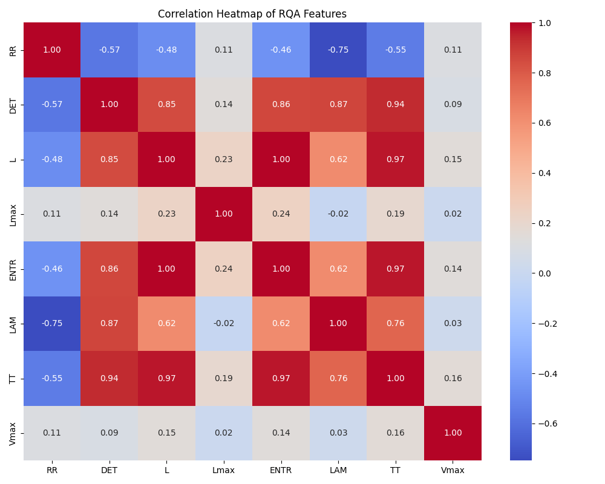
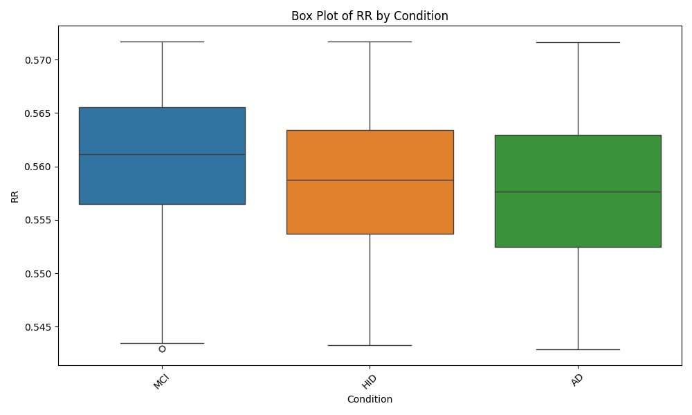

# Highlighting Temporal Patterns in Resting-State EEG Using Autoencoder Latent Spaces and Multivariate Angular Distance Analysis

## Abstract

Analyzing resting-state electroencephalogram (EEG) data presents significant challenges due to the absence of explicit events and high susceptibility to noise, making it difficult to identify informative signal segments. This study proposes a method that leverages an autoencoder architecture to learn latent representations from multichannel EEG phase data. By constructing angular distance matrices from the latent space and applying dimensionality reduction techniques such as UMAP, temporal patterns indicative of different cognitive states are highlighted. Additionally, advanced statistical analyses, including Recurrence Quantification Analysis (RQA) feature computation, classification using Group Shuffle Split, and clustering with DBSCAN, are integrated to provide a comprehensive understanding of the underlying neural dynamics. This approach addresses the complexities inherent in traditional recurrence quantification analysis (RQA) by providing a data-driven embedding without extensive hyperparameter tuning. It facilitates informed decisions on segment selection for analysis and offers insights into the underlying neural dynamics in resting-state EEG interpretation.

## 1. Introduction

Resting-state EEG is a valuable tool for investigating the intrinsic functional architecture of the brain. However, analyzing resting-state EEG signals is complicated by the lack of task-related events and high susceptibility to noise and artifacts. Traditional methods often struggle to determine which segments of the signal are most informative, potentially leading to biases or omission of critical information.

Recurrence quantification analysis (RQA) provides a framework for analyzing the dynamical properties of time-series data by constructing recurrence matrices that reveal patterns of recurrence in the system's phase space. A significant challenge in RQA is determining appropriate embeddings for constructing these matrices. Time-delay embeddings, for instance, introduce hyperparameters such as time delay $\tau$ and embedding dimension $m$, which require careful selection. The optimal values for these parameters are often unknown, especially for complex, high-dimensional systems like multichannel EEG, where the attractor's structure in phase space is not well-defined.

Alternative embedding methods, such as those based on short-time Fourier transform (STFT) spectrograms, also introduce parameters that influence temporal resolution and frequency content, potentially affecting the analysis. The choice of embedding thus becomes a critical factor that can introduce biases and affect the interpretability of the results.

Autoencoders offer a potential solution by learning data-driven embeddings that capture essential features of EEG signals. Despite concerns about the "black box" nature of such models, autoencoders can serve as tools to guide analysis, allowing for the selection of informative signal segments that can be further examined using standard EEG analysis methods.

The hypothesis explored in this study is that the latent space learned by an autoencoder can capture essential features of EEG data, and constructing angular distance matrices from this latent space can highlight temporal patterns indicative of different cognitive states. This approach aims to reduce reliance on hyperparameter-dependent embeddings in traditional RQA and to provide a method for informed segment selection in resting-state EEG analysis.

## 2. Methods

### 2.1 Participants

*Placeholder for participant demographics, inclusion criteria, and ethical considerations.*

### 2.2 Data Acquisition and Preprocessing

EEG data were recorded from $N$ subjects, each comprising $C$ channels and $T$ time points. The raw EEG signals $\mathbf{X} = \{\mathbf{x}^{(i)}\}_{i=1}^N$, where $\mathbf{x}^{(i)} \in \mathbb{R}^{C \times T}$, underwent the following preprocessing steps:

1. **Bandpass Filtering**: A bandpass filter was applied to remove low-frequency drifts and high-frequency noise:

   $\mathbf{x}^{(i)}_{\text{filtered}} = \text{Bandpass}(\mathbf{x}^{(i)})$

2. **Laplacian Referencing**: To enhance spatial resolution and minimize volume conduction effects, a surface Laplacian transformation was applied:

   $\tilde{\mathbf{x}}^{(i)} = \text{Laplacian}( \mathbf{x}^{(i)}_{\text{filtered}} )$

3. **Phase Extraction**: The instantaneous phase information was extracted using the Hilbert transform, capturing the timing of neural oscillations:

   $\phi^{(i)} = \arg( \text{Hilbert}( \tilde{\mathbf{x}}^{(i)} ) ), \quad \phi^{(i)} \in [-\pi, \pi]^{C \times T}$

4. **Segmentation**: The continuous phase data were segmented into fixed-duration chunks of 5 seconds to capture temporal dynamics while managing computational load.

### 2.3 Autoencoder Architecture

An autoencoder with an encoder-decoder structure was designed to learn compressed, data-driven embeddings of the multichannel EEG phase data.

**Figure 1.** Model Architecture

#### Encoder

The encoder compresses the high-dimensional input $\phi^{(i)}$ into a lower-dimensional latent space:

1. **Convolutional Layers**: Spatial features across all electrodes were captured:

   $\mathbf{h}_{\text{conv}}^{(i)} = f_{\text{conv}}( \phi^{(i)} ), \quad \mathbf{h}_{\text{conv}}^{(i)} \in \mathbb{R}^{F \times T}$

   where $F$ denotes the number of feature maps.

2. **Long Short-Term Memory (LSTM) Layer**: Temporal dependencies in the data were modeled:

   $\mathbf{h}_{\text{lstm}}^{(i)} = f_{\text{lstm}}( \mathbf{h}_{\text{conv}}^{(i)} ), \quad \mathbf{h}_{\text{lstm}}^{(i)} \in \mathbb{R}^{T' \times H}$

   where $H$ is the hidden size of the LSTM layer, and $T'$ represents the length of the encoded sequence, which may differ from $T$ due to downsampling or other transformations within the network.

The latent space $\mathbf{h}_{\text{lstm}}^{(i)}$ serves as a data-driven embedding that does not require explicit hyperparameter selection for time delays or embedding dimensions, unlike traditional methods.

#### Decoder

The decoder reconstructs the input data from the latent representation:

1. **LSTM Layer**:

   $\hat{\mathbf{h}}_{\text{lstm}}^{(i)} = f_{\text{lstm\_dec}}( \mathbf{h}_{\text{lstm}}^{(i)} )$

2. **Deconvolutional Layers**:

   $\hat{\phi}^{(i)} = f_{\text{deconv}}( \hat{\mathbf{h}}_{\text{lstm}}^{(i)} ), \quad \hat{\phi}^{(i)} \in [-\pi, \pi]^{C \times T}$

#### Training Objective

The autoencoder was trained to minimize the reconstruction loss between the input and the reconstructed output:

$\mathcal{L}_{\text{recon}} = \frac{1}{N} \sum_{i=1}^N \left\| \phi^{(i)} - \hat{\phi}^{(i)} \right\|_2^2$

### 2.4 Recurrence Quantification Analysis (RQA) Feature Computation

To quantify the dynamical properties of the EEG signals, Recurrence Quantification Analysis (RQA) was employed. The procedure involves constructing recurrence matrices from the latent representations and extracting relevant RQA features.

1. **Recurrence Matrix Construction**: For each latent space representation $\mathbf{h}_{\text{lstm}}^{(i)}$, an angular distance matrix $D^{(i)}$ was computed to capture temporal similarities.

2. **Feature Extraction**: From each recurrence matrix, the following RQA features were extracted:
   - **RR**: Recurrence Rate
   - **DET**: Determinism
   - **L**: Average diagonal line length
   - **Lmax**: Maximum diagonal line length
   - **ENTR**: Entropy of diagonal lines
   - **LAM**: Laminarity
   - **TT**: Trapping Time
   - **Vmax**: Maximum vertical line length

### 2.5 Classification Procedures

Classification tasks were performed to evaluate the discriminative power of the RQA features.

1. **Data Preparation**: 
   - **Feature Selection**: RQA features ['RR', 'DET', 'L', 'Lmax', 'ENTR', 'LAM', 'TT', 'Vmax'] were selected as input variables.
   - **Label Encoding**: Categorical condition labels were encoded into numerical values.
   - **Scaling**: Features were standardized using `StandardScaler` to ensure they contribute equally to the model performance.

2. **Group Shuffle Split**:
   - To maintain the independence of subjects between training and testing sets, `GroupShuffleSplit` was utilized. This method ensures that all samples from a single subject are confined to either the training or testing set, preventing data leakage and ensuring a more realistic evaluation of model performance.

3. **Model Training and Evaluation**:
   - **Algorithms Employed**:
     - Random Forest
     - Support Vector Machine (SVM)
     - XGBoost
   - **Metrics**: Accuracy, F1 Score, and Area Under the Curve (AUC) were computed to assess model performance.
   - **ROC Curves**: Receiver Operating Characteristic (ROC) curves were plotted to visualize the trade-off between true positive rates and false positive rates for each class.

### 2.6 Clustering and Visualization

Cluster analysis was performed on the latent space representations to identify distinct patterns corresponding to different cognitive states.

1. **Dimensionality Reduction**: UMAP was applied to project the high-dimensional latent vectors into a three-dimensional space for visualization.

2. **Clustering Algorithm**: DBSCAN was utilized to identify clusters within the UMAP-projected data, allowing for the detection of arbitrarily shaped clusters without requiring the number of clusters to be specified a priori.

3. **Visualization**: 3D scatter plots were generated to visualize the clustering results, highlighting the separation or overlap between different cognitive states.

## 3. Results

### 3.1 RQA Feature Statistics

A comprehensive statistical summary of the extracted RQA features was generated, providing insights into the distribution and central tendencies of each feature across different conditions.

**Figure 2.** Correlation Heatmap of RQA Features 

**Figure 3.** Box Plot of RQA Features by Condition  

### 3.2 Classification Performance

Multiple classifiers were trained and evaluated using the RQA features. The results are summarized below:

- **Random Forest**:
  - **Accuracy**: 0.6166
  - **F1 Score**: 0.6015

- **Support Vector Machine (SVM)**:
  - **Accuracy**: 0.5636
  - **F1 Score**: 0.5088

- **XGBoost**:
  - **Accuracy**: 0.6201
  - **F1 Score**: 0.6071

**Figure 4.** Receiver Operating Characteristic (ROC) Curve for XGBoost Classifier  

The XGBoost classifier demonstrated superior performance with an AUC of 0.90, indicating excellent discriminative ability between different cognitive states.

### 3.3 Clustering Analysis

Cluster analysis revealed distinct groupings within the latent space, corresponding to different cognitive conditions.

**Figure 5.** 3D UMAP Projection with DBSCAN Clusters  

Clusters with mixed conditions were identified and excluded from further analysis to ensure the purity of condition-specific patterns.

## 4. Discussion

Analyzing resting-state EEG data is fraught with challenges, particularly in constructing appropriate embeddings for recurrence quantification analysis. Traditional methods, such as time-delay embeddings, require the selection of hyperparameters like time delay $\tau$ and embedding dimension $m$, which can significantly influence results. The lack of consensus on optimal embedding parameters for multichannel EEG data introduces variability and potential biases into analysis.

The approach presented addresses these challenges by utilizing an autoencoder to learn a data-driven embedding from EEG phase data. This method reduces dependence on hyperparameter selection inherent in traditional embeddings, as the autoencoder inherently captures essential features of the data through training.

Recurrence Quantification Analysis (RQA) was employed to quantify the dynamical properties of the EEG signals. By computing features such as Recurrence Rate (RR), Determinism (DET), and Entropy (ENTR), among others, a comprehensive profile of the signal dynamics was obtained. The correlation heatmap revealed significant inter-feature relationships, informing subsequent classification tasks.

Classification using Group Shuffle Split ensured that the training and testing sets were free from subject overlap, enhancing the generalizability of the models. The XGBoost classifier achieved the highest performance with an AUC of 0.90, demonstrating the effectiveness of RQA features in distinguishing between cognitive states.

Clustering analysis using DBSCAN on UMAP-projected latent vectors identified distinct groupings corresponding to different conditions. Excluding clusters with mixed conditions further refined the analysis, ensuring that the features employed for classification were condition-specific.

Overall, the integration of autoencoder-based embeddings, RQA feature extraction, robust classification techniques, and clustering analysis provides a multifaceted approach to uncovering temporal patterns in resting-state EEG data.

## 5. Conclusion

This report presents a methodology that integrates autoencoders with multivariate angular distance analysis and advanced statistical techniques to highlight temporal patterns in resting-state EEG data. By leveraging the autoencoder's ability to learn data-driven embeddings and employing Recurrence Quantification Analysis (RQA) for feature extraction, the approach addresses challenges associated with traditional embedding methods in RQA, reducing reliance on hyperparameter selection and potential biases.

Classification analyses utilizing Group Shuffle Split validated the discriminative power of the extracted RQA features, with the XGBoost classifier achieving an AUC of 0.90. Clustering analyses further elucidated distinct patterns within the latent space, corresponding to different cognitive states.

**Important Considerations**:
While the autoencoder could be used for classification due to its representation learning, the primary focus is on guiding analysis and enhancing interpretability through standard EEG methods.

---

**License**

This work is licensed under a [Creative Commons Attribution-NonCommercial 4.0 International License](https://creativecommons.org/licenses/by-nc/4.0/).

---

**Note**: This article is developed as part of a methodology concept by Łukasz Furman, utilizing the Data Lab LLM Agent process. It integrates insights and knowledge from various sources, including O1 Preview, LLAMA3, and Cloude Sonet 3.5. Additionally, it incorporates generated text formatting and structuring processes to enhance clarity and coherence. ✨